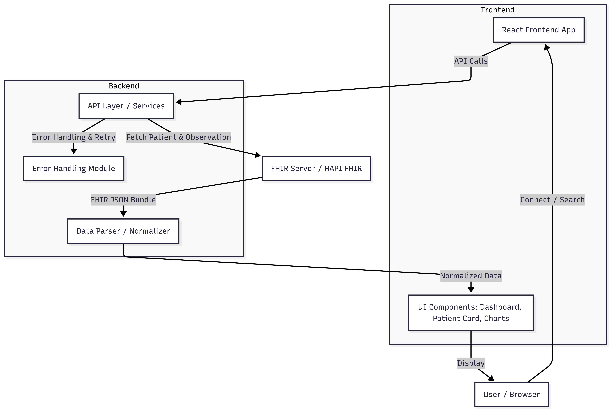

# D4CG: SMART on FHIR Patient Dashboard | PoC

A modern, patient-centric frontend designed to simplify how users connect to FHIR servers, fetch their medical records, and visualize complex clinical data. The dashboard transforms raw FHIR JSON into meaningful health insights, enabling patients to understand, control, and interact with their personal health information with clarity and confidence.

A modern, patient-centric frontend designed to simplify how users connect to FHIR servers, fetch their medical records, and visualize complex clinical data. The dashboard transforms raw FHIR JSON into meaningful health insights, enabling patients to understand, control, and interact with their personal health information with clarity and confidence.



<br />

<p align="center">

  <!-- 🌍 Live Project -->
  <a href="#" target="_blank">
    
  </a>

  <!-- 📂 GitHub Repo -->
  <a href="#" target="_blank">
    
  </a>

  <!-- 📝 Case Study -->
  <a href="#" target="_blank">
    
  </a>

  <!-- ✍️ Blog (Portfolio) -->
  <a href="#" target="_blank">
    
  </a>

  <!-- 🔗 LinkedIn Post -->
  <a href="#" target="_blank">
    
  </a>

</p>

---

## 🛠️ Tech Stack

- **🎨 Frontend Core**: React 18, Vite
- **🎨 Styling Architecture**: Tailwind CSS (Custom Design System Tokenization)
- **🔄 Data & State Management**: React Query (@tanstack), Promise-based API wrappers
- **🏥 Healthcare Standards**: FHIR (R4), Prepared for SMART OAuth PKCE
- **📏 Code Quality**: ESLint, Prettier

---

## Core Features

### 🔗 Asynchronous FHIR Connectivity

- Handles simulated API latency and response variability gracefully.
- Provides stable loading states and fallback UI for unavailable patient data.

### 👤 Dynamic Patient Profiling

- Converts deeply nested FHIR data into clear UI components.
- Generates deterministic avatars and top-profile cards based on patient ID.

### 📊 Priority Medical Observations

- Highlights top 6 vital signs (Heart Rate, Blood Pressure, etc.) using heuristic algorithms.
- Prevents cognitive overload by filtering non-critical data.

### 📈 Pure-DOM Sparkline Trends

- MiniChart.jsx produces high-performance sparkline charts without heavy libraries.
- Fully responsive, small footprint, and visually consistent.

### ⚡ Concurrent Data Hydration

- Simultaneously fetches /Patient and /Observation bundles.
- Caches results to reduce redundant API calls and improve UX.

### ❌ Graceful Error Handling

- Custom zero-state and error-state components guide users when data is unavailable.
- Maintains professional and patient-focused interface in edge cases.


---

## 🗂️ File and Folder Structure

```text
src
 ┣ components
 ┃ ┣ EmptyState.jsx       # Initial "Connect to FHIR" input screen
 ┃ ┣ ErrorState.jsx       # Fallback UI for failed API calls / Not Found
 ┃ ┣ Header.jsx           # Global top navigation bar
 ┃ ┣ Layout.jsx           # App shell wrapper
 ┃ ┣ Loader.jsx           # Custom animated skeleton loading bars
 ┃ ┣ MiniChart.jsx        # Div-based responsive sparkline charts
 ┃ ┣ ObservationCard.jsx  # Individual vital sign display bento card
 ┃ ┣ ObservationList.jsx  # Engine that maps and filters top 6 vitals
 ┃ ┣ PatientCard.jsx      # Top profile card with dynamically generated avatar
 ┃ ┣ PatientInfo.jsx      # Bottom extended patient contact/demographic details
 ┃ ┣ Sidebar.jsx          # Left-pane navigation routing (Dashboard & Case Study)
 ┃ ┗ StatsCard.jsx        # Key metric displays for the hero grid
 ┣ data
 ┃ ┗ architecture.png     # System flow visual mapping diagram
 ┣ hooks
 ┃ ┗ usePatientData.js    # Custom React Query hook fetching API concurrently
 ┣ pages
 ┃ ┣ CaseStudyPage.jsx    # Premium PoC explanation landing page
 ┃ ┗ DashboardPage.jsx    # Main patient visualization grid execution
 ┣ services
 ┃ ┣ api.js               # Network latency simulator & data fetcher
 ┃ ┗ mockData.js          # Raw FHIR standard JSON responses
 ┣ utils
 ┃ ┣ formatters.js        # Pure string handlers
 ┃ ┗ normalizeData.js     # Anti-corruption layer parsing FHIR JSON structures
 ┣ App.jsx                # React Router DOM definitions
 ┣ index.css              # Tailwind baseline and custom custom classes
 ┗ main.jsx               # React DOM Entry point
```

---

## Conclusion 

This PoC successfully addresses the core UI/UX challenges of modern Electronic Health Records. By decoupling the complex FHIR JSON layer through a robust normalization architecture, the interface is:

- Resilient, predictable, and fully testable
- Highly patient-centric with clear visualization of critical health data
- Scalable for future SMART OAuth and multi-provider integration

The dashboard exemplifies how a patient-focused health platform can transform raw clinical data into actionable insights, paving the way for modern, accessible healthcare applications.

---

## Contact

<p align="center">
  <a href="https://aadil-amjad.me" target="_blank">
    
  </a>
  <a href="https://www.linkedin.com/in/adilamjad00" target="_blank">
    
  </a>
  <a href="https://github.com/adilarain00" target="_blank">
    
  </a>
  <a href="mailto:addilarain00@gmail.com">
    
  </a>
</p>